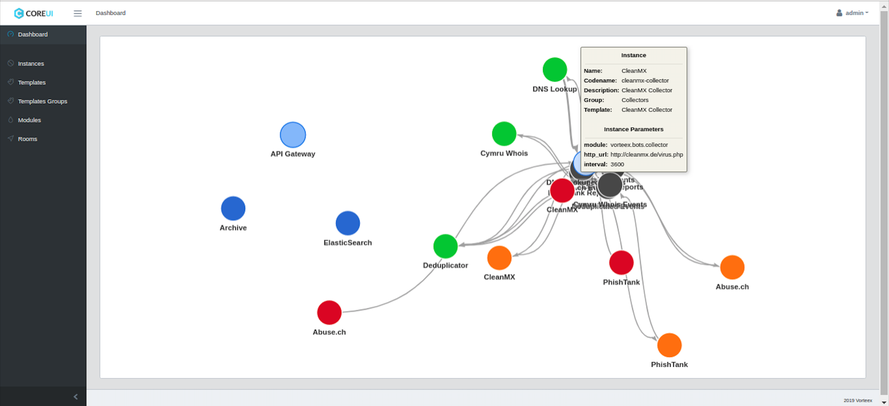

# Vorteex frontend

This repo is a from my React Redux mentoring work to build a OpenSouce frontend solution for IT security teams for collecting and processing security feeds using a message queuing protocol.

:) NO BACKEND AVAILABLE

<table cellpadding="1" cellspacing="1">
<tr>
  <td></td>
  <td></td>
</tr>

<tr>
  <td></td>
  <td></td>
</tr>

<tr>
  <td></td>
  <td>
  </td>
</tr>

<tr>
  <td></td>
  <td> </td>
</tr>
</table>


## Install

```sh
git clone https://github.com/jorgemcdev/vorteex-frontend
cd vorteex-frontend
npm install
```

## Run in development mode with Hot Reload
```sh
npm run dev
```

## Build
```sh
npm run build
```

## Run production build on Local Machine
```sh
npm start
```

## Deploy

### Deploy to S3
1) Create a .env file in the root folder

```sh
AWS_S3_ACCESS_KEY_ID = ''
AWS_S3_SECRET_ACCESS_KEY = ''
AWS_S3_REGION = ''
AWS_S3_BUCKET = ''
```

2) Create and Configure S3 Bucket Policy
```sh
{
  "Id": "Policy1511261302545",
  "Version": "2012-10-17",
  "Statement": [
    {
      "Sid": "Stmt1511261285825",
      "Action": [
        "s3:GetObject"
      ],
      "Effect": "Allow",
      "Resource": "arn:aws:s3:::your-bucket-name/*",
      "Principal": "*"
    }
  ]
}
```

3) Go to “Properties”, “Static Website Hosting”. Select use this bucket to host a website.


4) Deploy
```sh
npm run deploy
```

> [S3 Deploy Article](https://medium.com/ovrsea/deploy-automatically-a-react-app-on-amazon-s3-iam-within-minutes-da6cb0096d55)

## TODOS

### Webpack
1. Optimize comonChunks and Tree Shaking

